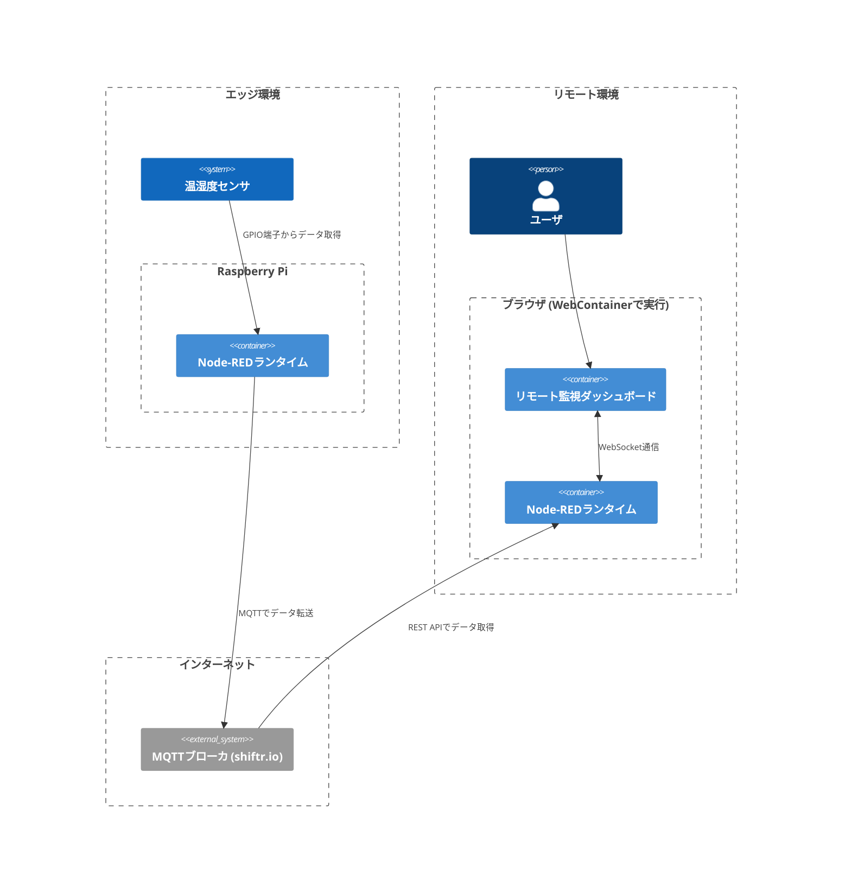
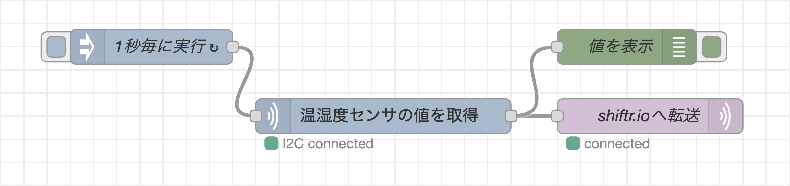
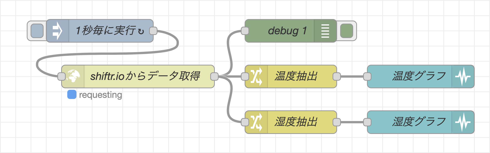
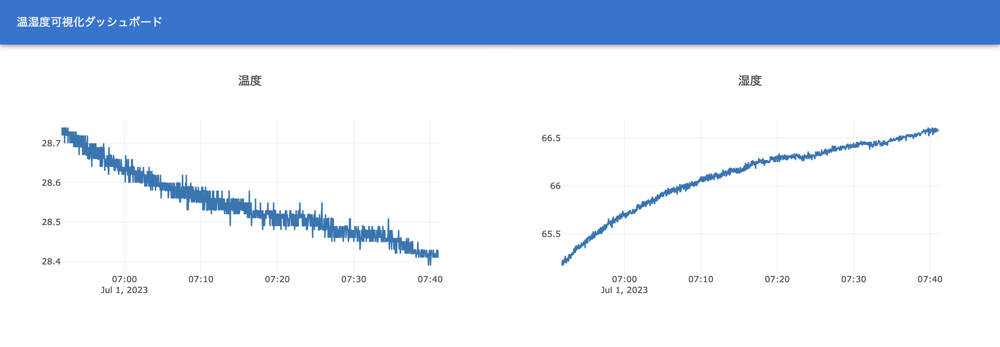
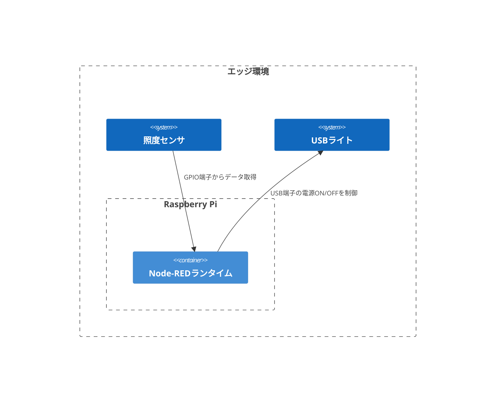
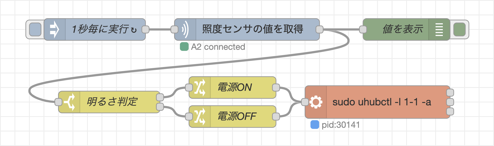
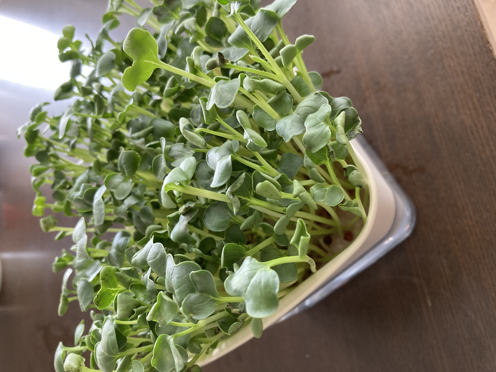

# Node-REDでカイワレ大根を育ててみた
## 背景
北海道とIoTと言えば「スマート農業」ということで、Raspberry Piで植物を栽培をしてみた。


## 開発したもの
Raspberry Piで温湿度センサデータの値をクラウドへ転送し、リモートから監視できるダッシュボードを作成。


また、夜も光合成できるよう、LED照明の自動制御も同じRaspberry Piで行ってみた。
## 用いたもの
- ハードウェア
  - Raspberry Pi 4 Model B (メモリ4GB)
  - Grove HAT
  - Grove 光センサ
  - Grove 温度湿度センサ (SHT31)
  - USBライト
- ソフトウェア
  - Node-RED
  - Groveノード (node-red-contrib-grove-base-hat)
  - React Node-REDダッシュボード
- サービス
  - shiftr.io (MQTTやREST APIでデータを送受信できるMQTTブローカ)
  - WebContainer (Node.jsをブラウザ上で実行できるWebAssembly実装の環境)
- その他
  - カイワレ大根の種
  - 容器

## 開発したフロー1: リモート監視ダッシュボード
- システム構成
  - エッジ側のRaspberry Piで、センサデータを収集して、shiftr.ioへ転送
  - リモート環境側では、ユーザのウェブブラウザ上でNode-REDランタイムを動かし、shiftr.ioからデータ取得、可視化


WebContainerを用いて、ユーザインターフェイスの表示や、REST APIからのデータ取得などのフロントエンド処理を、ブラウザ上で行なっていることが特徴。
クラウド上にNode-REDのサーバを24時間立ち上げておく必要がないため、無料でリモート監視ダッシュボードを利用できる。

- エッジ側のフロー

  定期的に、Groveノードで温湿度データを取得し、そのままshiftr.ioへMQTTプロトコルで転送。

  

- ブラウザ上で動作するフロー

  定期的にshiftr.ioのREST APIにアクセスして、最新の温湿度データをまとめて取得。その後、changeノードで温度と湿度のデータに分けてそれぞれ、chartノードで時系列グラフを表示。

  

- ブラウザ上で動作するダッシュボード

  パス`/uikit`を指定してページを開くと、温湿度データの時系列グラフがリアルタイムに表示される。

  
  [](https://stackblitz.com/github/kazuhitoyokoi/node-red-ogiri-sapporo?embed=1&hideExplorer=1&hideNavigation=1&view=preview&initialpath=uikit)

これで、外出中でも部屋温度や湿度が分かるようになりました❗️(エアコンの消し忘れ確認もバッチリ✌️)

## 開発したフロー2: LED照明の自動制御
- システム構成
  - Raspberry Piは、照度センサの値を定期的に取得
  - 明るいと判定した際にUSBライトの電源OFF、暗いと判断した際にUSBライトの電源をOFF


- USB電源の制御コマンド
  - uhubctlコマンドをインストール
    ```
    sudo apt-get update
    sudo apt-get install uhubctl
    ```

  - USB電源ONコマンド
    ```
    sudo uhubctl -l 1-1 -a 0
    ```

  - USB電源OFFコマンド
    ```
    sudo uhubctl -l 1-1 -a 1
    ```

  - ターミナルから操作した時の様子

    https://github.com/kazuhitoyokoi/node-red-ogiri-sapporo/assets/20310935/2611d95c-bc5d-4933-80cb-3726c9236332

- 照度に応じてUSB電源ON/OFFを操作するフロー
  - 照度センサの値が小さい時に1のメッセージ、大きい時に0のメッセージを生成するようにした。
  - uhubctlコマンドをexecノードに記載し、1または0のメッセージで、USB電源のONとOFFを切り替えれるようにした。
  

- フロー実行時の様子

  部屋の照明が消えている時はUSBライトがONになる。照明をつけると、すぐUSBライトがOFF。再度照明を消すとUSBライトがONになる。

  https://github.com/kazuhitoyokoi/node-red-ogiri-sapporo/assets/20310935/5cd2185a-ef3c-4e77-9025-129a70b98606

  もちろん、実運用時は日が沈むとUSBライトが点灯し、日が昇ると消灯します🌅

# 成長の様子


すくすく育ち、無事収穫できました🌱🍽️
